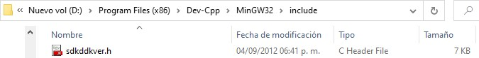
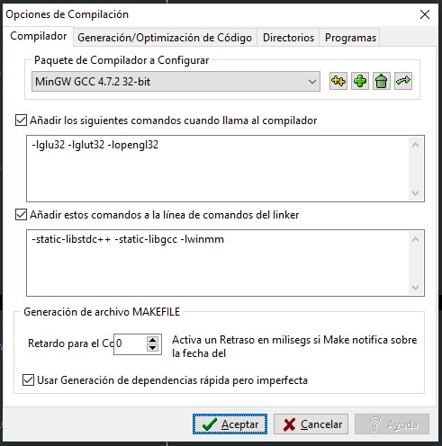

# Extreme Road
Juego elaborado como proyecto final para la materia de Graficación.

## Instrucciones para su ejecución
A continuación se presentarán todos aquellos pasos que se deben de seguir para poder ejecutar de forma correcta el programa:

### Tecnologías necesarias:

- Este juego debe ser ejecutado dentro de DEV-C++
- [OpenGL](https://www.opengl.org/)
- Librería [sdkddkver.h](https://github.com/EddieRingle/portaudio/blob/master/src/hostapi/wasapi/mingw-include/sdkddkver.h)

### Pasos a seguir:

1. Primero es necesario configurar DEV C++ con OpenGL, siguiendo los pasos del siguiente [video](https://www.youtube.com/watch?v=RTk6W67dyR4).
2. Posteriormente se debe configurar la librería sdkddkver.h, para ello es necesario añadirla dentro de la carpeta de instalación de DEV C++, dentro de MinGW32/include:

3. Por último es necesario configurar correctamente las opciones del linker, para ello, se debe agregar la instrucción -lwinmm, como se puede observar a continuación:

## ¿Cómo jugar?
A continuación se encuentran las instrucciones propias del juego, así como los controles del mismo:

### Instrucciones:

1. El juego comienza con el jugador avanzando sobre una carretera, en la cual deberá evitar chocar con los camiones que se encuentre hasta llegar al final de la misma.
2. Una vez el jugador llege al final de la carretera, comenzará un nuevo nivel. Si alcanzas el nivel 5 ganarás el juego.
3. Si chocas con algún camión, perderás la partida.
4. Para volver a jugar, tendrás que ejecutar el archivo del juego nuevamente.

### Controles:

- La tecla 'A' le permite al jugador moverse hacia la izquierda.
- La tecla 'D' le permite al jugador moverse hacia la derecha.
- La tecla 'ESC' le permite al jugador salirse del juego en cualquier momento.

## Integrantes
Trabajo elaborado por los estudiantes:

- [Calvo Torres Jafed](https://github.com/JafedCalvo)
- [Comenares Cortés Oliver Axel](https://github.com/OliverColmenares)
- [Monteón Ricárdez Nizvan](https://github.com/Nizvan018)
- [Salazar Vásquez Viviana Isabel](https://github.com/chocovivis)